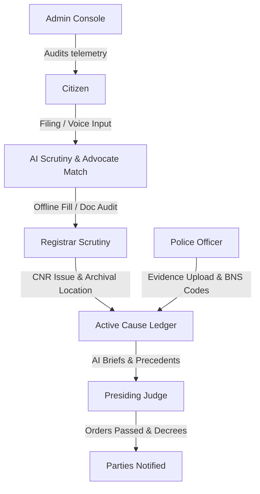

# NyayaFlow AI ⚖️

> **Sovereign Indian Judicial Intelligent Assistant Platform**  
> *Under Human Authority. AI as the Assistant, Never the Judge.*

NyayaFlow AI is a production-grade, AI-powered judicial workflow management platform designed specifically for the Indian legal ecosystem. It streamlines case filings, police incident entries, document health auditing, and cause-list briefing, while strictly enforcing structural security boundaries that keep human authorities in absolute control of final decisions.

---

## 🏛️ Project Architecture & Stakeholder Roles

NyayaFlow AI connects six independent stakeholders inside a single unified pipeline:



1. **Citizen / Litigant**: Translates verbal/written grievances in regional languages, classifies case types, audits file health, downloads subordinate court filing templates, and connects with matched advocates.
2. **Advocate**: Reviews matching litigant requests, accepts representation, and manages pending case dossiers.
3. **Police Officer**: Inputs FIR narratives, registers digital hashes of forensic files, and confirms BNS (Bharatiya Nyaya Sanhita) penal mapping suggestions.
4. **Registrar**: Reviews case checklists, links physical archival locations (building, room, shelf, box) to digitized profiles, and assigns official court CNR numbers.
5. **Presiding Judge**: Inspects daily cause lists, accesses AI-generated brief summaries, maps precedents, and signs bench orders.
6. **Administrator**: Audits immutable log tables, tracks district caseload density maps, and monitors server cluster telemetry.

---

## ⚙️ Tech Stack & Dependencies

*   **Frontend**: Next.js 16 (App Router), React 19, TypeScript, Tailwind CSS v4, Framer Motion, Lucide icons, Recharts.
*   **Backend**: Python, FastAPI, Uvicorn, Google-GenerativeAI (Gemini SDK), python-dotenv.
*   **Database**: PostgreSQL / Supabase, Row-level Security (RLS).
*   **OCR**: PyTesseract, pdf2image (scanned file audits).

---

## 📂 Folder Structure

```text
nyaya_flow/
├── backend/
│   ├── db/
│   │   └── schema.sql        # Postgres database migrations
│   ├── services/
│   │   └── gemini.py         # Gemini AI completions & mock failover logic
│   ├── main.py               # FastAPI application routing & CORS middlewares
│   ├── schemas.py            # Pydantic data schemas
│   └── requirements.txt      # Python dependencies
├── docs/
│   └── database.md           # Entity relationship database details
├── public/                   # Shared image & vector assets
├── src/
│   ├── app/
│   │   ├── api/
│   │   │   └── mock/
│   │   │       └── route.ts  # Next.js API mock route responder
│   │   ├── auth/
│   │   │   └── page.tsx      # Unified portal login page
│   │   ├── citizen/dashboard/page.tsx   # Litigant wizard & tracking workspace
│   │   ├── advocate/dashboard/page.tsx  # Lawyer matching request inbox
│   │   ├── police/dashboard/page.tsx    # Investigating officer BNS analyzer
│   │   ├── registrar/dashboard/page.tsx # Scrutiny checklist & archive logger
│   │   ├── judge/dashboard/page.tsx     # Bench order entry & precedents lookups
│   │   ├── admin/dashboard/page.tsx     # Workload telemetry & logs table
│   │   ├── globals.css       # Tailwind colors & glassmorphic utilities
│   │   └── layout.tsx        # SEO configurations & Outfit fonts loader
│   └── components/
│       ├── neural-network.tsx  # Interactive particle background
│       ├── scales-of-justice.tsx # Floating balanced vector scales
│       ├── courthouse.tsx      # Animated SVG structural courthouse
│       └── india-map.tsx       # Live caseload radar map of India
├── package.json              # npm package details
└── tsconfig.json             # TypeScript rules
```

---

## 🚀 Quick Start Guide

NyayaFlow includes an **Interactive Sandbox Mode** in the frontend, enabling you to test every dashboard workflow instantly without starting Python servers or Postgres instances.

### 1. Run the Frontend (Next.js)

At the workspace root directory:
```bash
# 1. Install packages
npm install --legacy-peer-deps

# 2. Start Next.js development server
npm run dev
```
Open **`http://localhost:3000`** in your browser.

### 🔑 Sandbox Mock Login Credentials

Click **Sign In Portal** from the landing page. Select a role and click the **Quick Autofill Test** button to sign in instantly, or use these credentials:

| Role | Username / Identity ID | Access PIN / OTP Code |
| :--- | :--- | :--- |
| **Citizen Litigant** | `5544-6677-8899` *(Aadhaar)* | `482091` *(OTP)* |
| **Advocate Lawyer** | `BCI/DEL/4921-2015` *(Bar ID)* | `772291` *(Private Key)* |
| **Police Officer** | `IPS-89210-DL` *(Badge)* | `110001` *(Station PIN)* |
| **Court Registrar** | `REG-44912-DL` *(Clerk ID)* | `889921` *(Bench PIN)* |
| **Judicial Judge** | `JUD-DL-0049` *(COP ID)* | `004922` *(Secure PIN)* |
| **System Admin** | `ADMIN-SYS-99` *(Admin ID)* | `990022` *(Audit PIN)* |

---

### 2. Run the Backend (FastAPI + Python)

To connect the live AI advisory engine:

1. Create a `backend/.env` file:
   ```env
   GEMINI_API_KEY="your-google-gemini-api-key-here"
   ```
2. Set up dependencies and start:
   ```bash
   cd backend
   pip install -r requirements.txt
   python main.py
   ```
The backend service will run on `http://localhost:8000`. You can review the Swagger documentation at `http://localhost:8000/docs`.

---

## ⚖️ Strict Sovereign AI Safe-Use Guardrails

To prevent hallucination or loss of human sovereignty:
1. **No Auto-CNR Generation**: Registry CNR numbers must be issued by the official government court system and registered manually by a Registrar.
2. **Advisory Document Scrutiny**: AI checks document health scores and lists missing fields, but *cannot* reject or modify petitions.
3. **Draft Offense Suggestion**: BNS section suggestions are presented to Police Officers as mapping recommendations; officers must manually verify and confirm selections.
4. **Summary Reference Briefs**: Judges are presented with previous hearing chronologies and historical precedent citation matches; the final order decree is drafted exclusively by the human judge.
