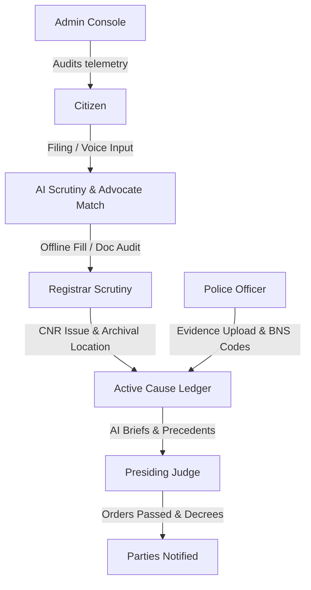
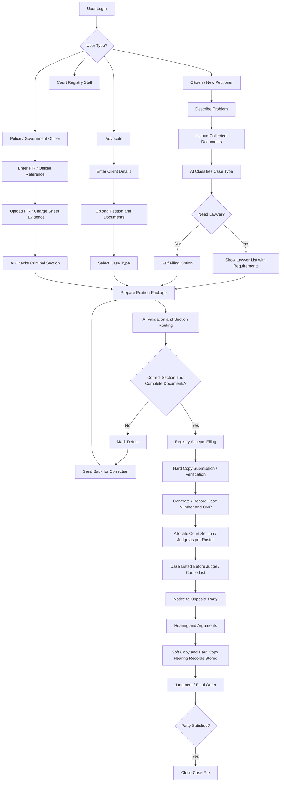

# NyayaFlow AI ⚖️

**"Justice delayed is often justice denied. NyayaFlow ensures that justice begins with the right filing, the right guidance, and the right information."**

NyayaFlow AI is an intelligent judicial workflow platform designed to modernize India's legal ecosystem by simplifying petition filing, digitizing judicial records, enabling AI-assisted document verification, and improving collaboration between citizens, advocates, police officers, registrars, and judges.

Rather than replacing legal professionals, NyayaFlow acts as an intelligent assistant that reduces paperwork, minimizes procedural errors, and accelerates administrative workflows while ensuring that all legal decisions remain under human authority.
---
**Vision Statement**

"NyayaFlow envisions an India where every citizen can access justice without being overwhelmed by legal complexity, unnecessary paperwork, or procedural delays. By combining Artificial Intelligence with human judicial authority, we aim to build a transparent, efficient, and citizen-centric legal ecosystem."
---
**Problems We Solve**

The Indian judicial system manages millions of cases every year. Despite continuous digitization efforts, several challenges remain.

1️⃣ Incorrect Case Filing

Many citizens are unfamiliar with legal procedures.

They often do not know:

Which court has jurisdiction.
Which type of petition should be filed.
Which documents are mandatory.
Whether the dispute is civil, criminal, consumer, cyber, or family-related.

This frequently results in:

Rejected petitions
Incorrect filings
Long delays
Multiple court visits
NyayaFlow Solution

Our AI analyzes the dispute in natural language and recommends:

Appropriate case category
Court jurisdiction
Required supporting documents
Filing checklist
2️⃣ Physical Document Storage

Even today, courts maintain enormous collections of physical records.

Problems include:

Lost files
Damaged documents
Difficult retrieval
High storage costs
Duplicate records

Finding a case file can sometimes take hours or days.

NyayaFlow Solution

Every petition receives a secure digital profile containing:

Petition
Evidence
Court orders
Judgments
Hearing history
Archive location

Documents become searchable instantly.

3️⃣ No Digital Verification Before Physical Submission

Citizens currently submit original documents without prior validation.

If documents contain:

Missing signatures
Wrong formats
Missing annexures
Poor scan quality

they must visit the court repeatedly.

NyayaFlow Solution

NyayaFlow introduces a Digital Pre-Scrutiny Workflow.

Citizen Uploads Documents

↓

AI Document Audit

↓

Missing Document Detection

↓

Registrar Verification

↓

Approval

↓

Physical Document Submission

Original documents are submitted only after digital verification.

This reduces unnecessary visits and administrative delays.

4️⃣ Lack of Transparency

Citizens often have little visibility into:

Petition status
Verification progress
Hearing schedules
Registrar actions
NyayaFlow Solution

Real-time dashboards display:

Filing status
Registrar approval
Police investigation
Court hearings
Final judgment
5️⃣ Manual Administrative Work

Court staff manually:

Register petitions
Verify documents
Categorize disputes
Assign departments

This consumes valuable time.

NyayaFlow Solution

AI automates repetitive administrative tasks while keeping final approval under human control.

6️⃣ Fragmented Communication

Currently,

Citizen

↓

Advocate

↓

Police

↓

Registrar

↓

Judge

often use disconnected systems.

NyayaFlow connects all stakeholders through one unified platform.
---
## 🏛️ Project Architecture & Stakeholder Roles

NyayaFlow AI connects six independent stakeholders inside a single unified pipeline:


**System Flowchart**



1. **Citizen / Litigant**: Translates verbal/written grievances in regional languages, classifies case types, audits file health, downloads subordinate court filing templates, and connects with matched advocates.
2. **Advocate**: Reviews matching litigant requests, accepts representation, and manages pending case dossiers.
3. **Police Officer**: Inputs FIR narratives, registers digital hashes of forensic files, and confirms BNS (Bharatiya Nyaya Sanhita) penal mapping suggestions.
4. **Registrar**: Reviews case checklists, links physical archival locations (building, room, shelf, box) to digitized profiles, and assigns official court CNR numbers.
5. **Presiding Judge**: Inspects daily cause lists, accesses AI-generated brief summaries, maps precedents, and signs bench orders.
6. **Administrator**: Audits immutable log tables, tracks district caseload density maps, and monitors server cluster telemetry.

---

## ⚙️ Tech Stack & Dependencies

*   **Frontend**: Next.js 16 (App Router), React 19, TypeScript, Tailwind CSS v4, Framer Motion, Lucide icons, Recharts.
*   **Backend**: Python, FastAPI, Uvicorn, Google-GenerativeAI (Gemini SDK), python-dotenv.
*   **Database**: PostgreSQL / Supabase, Row-level Security (RLS).
*   **OCR**: PyTesseract, pdf2image (scanned file audits).

---

## 📂 Folder Structure

```text
nyaya_flow/
├── backend/
│   ├── db/
│   │   └── schema.sql        # Postgres database migrations
│   ├── services/
│   │   └── gemini.py         # Gemini AI completions & mock failover logic
│   ├── main.py               # FastAPI application routing & CORS middlewares
│   ├── schemas.py            # Pydantic data schemas
│   └── requirements.txt      # Python dependencies
├── docs/
│   └── database.md           # Entity relationship database details
├── public/                   # Shared image & vector assets
├── src/
│   ├── app/
│   │   ├── api/
│   │   │   └── mock/
│   │   │       └── route.ts  # Next.js API mock route responder
│   │   ├── auth/
│   │   │   └── page.tsx      # Unified portal login page
│   │   ├── citizen/dashboard/page.tsx   # Litigant wizard & tracking workspace
│   │   ├── advocate/dashboard/page.tsx  # Lawyer matching request inbox
│   │   ├── police/dashboard/page.tsx    # Investigating officer BNS analyzer
│   │   ├── registrar/dashboard/page.tsx # Scrutiny checklist & archive logger
│   │   ├── judge/dashboard/page.tsx     # Bench order entry & precedents lookups
│   │   ├── admin/dashboard/page.tsx     # Workload telemetry & logs table
│   │   ├── globals.css       # Tailwind colors & glassmorphic utilities
│   │   └── layout.tsx        # SEO configurations & Outfit fonts loader
│   └── components/
│       ├── neural-network.tsx  # Interactive particle background
│       ├── scales-of-justice.tsx # Floating balanced vector scales
│       ├── courthouse.tsx      # Animated SVG structural courthouse
│       └── india-map.tsx       # Live caseload radar map of India
├── package.json              # npm package details
└── tsconfig.json             # TypeScript rules
```

---

## 🚀 Quick Start Guide

NyayaFlow includes an **Interactive Sandbox Mode** in the frontend, enabling you to test every dashboard workflow instantly without starting Python servers or Postgres instances.

### 1. Run the Frontend (Next.js)

At the workspace root directory:
```bash
# 1. Install packages
npm install --legacy-peer-deps

# 2. Start Next.js development server
npm run dev
```
Open **`http://localhost:3000`** in your browser.

### 🔑 Sandbox Mock Login Credentials

Click **Sign In Portal** from the landing page. Select a role and click the **Quick Autofill Test** button to sign in instantly, or use these credentials:

| Role | Username / Identity ID | Access PIN / OTP Code |
| :--- | :--- | :--- |
| **Citizen Litigant** | `5544-6677-8899` *(Aadhaar)* | `482091` *(OTP)* |
| **Advocate Lawyer** | `BCI/DEL/4921-2015` *(Bar ID)* | `772291` *(Private Key)* |
| **Police Officer** | `IPS-89210-DL` *(Badge)* | `110001` *(Station PIN)* |
| **Court Registrar** | `REG-44912-DL` *(Clerk ID)* | `889921` *(Bench PIN)* |
| **Judicial Judge** | `JUD-DL-0049` *(COP ID)* | `004922` *(Secure PIN)* |
| **System Admin** | `ADMIN-SYS-99` *(Admin ID)* | `990022` *(Audit PIN)* |

---

### 2. Run the Backend (FastAPI + Python)

To connect the live AI advisory engine:

1. Create a `backend/.env` file:
   ```env
   GEMINI_API_KEY="your-google-gemini-api-key-here"
   ```
2. Set up dependencies and start:
   ```bash
   cd backend
   pip install -r requirements.txt
   python main.py
   ```
The backend service will run on `http://localhost:8000`. You can review the Swagger documentation at `http://localhost:8000/docs`.

---
**Objectives**

NyayaFlow aims to:

✅ Reduce filing errors

✅ Minimize paperwork

✅ Improve transparency

✅ Digitize judicial workflows

✅ Assist legal professionals with AI

✅ Improve access to justice
---
**Key Innovations**

AI Petition Intelligence

Automatically understands complaints and categorizes legal disputes.

Digital Case Repository

Every case contains:

Documents
Evidence
Hearing history
Court orders
Archive references
Smart Document Health Audit

Checks:

✔ Missing pages

✔ Missing signatures

✔ Invalid file formats

✔ OCR readability

✔ Mandatory documents

before submission.

Advocate Recommendation

Citizens receive advocate suggestions based on:

Practice area
Location
Court jurisdiction
Judicial Brief Generator

Instead of reading hundreds of pages,

Judges receive concise AI-generated summaries containing:

Facts
Timeline
Previous hearings
Relevant precedents
Registrar Archive Mapping

Physical files remain traceable.

Building

↓

Floor

↓

Room

↓

Shelf

↓

Box

↓

Case File

Digital records always know where the original file is stored.

Police Investigation Workspace

Police officers can:

Upload evidence
Link forensic reports
Suggest BNS sections
Generate investigation summaries
---
**Why NyayaFlow Matters**

NyayaFlow is not merely another e-filing portal.

It creates a complete digital judicial ecosystem where:

Citizens understand legal procedures.
Registrars verify digitally before physical filing.
Police manage evidence efficiently.
Advocates collaborate through one platform.
Judges receive intelligent summaries instead of massive case bundles.
---
** System Workflow**
Citizen

↓

AI Legal Assistant

↓

Petition Generation

↓

Document Upload

↓

AI Document Audit

↓

Registrar Verification

↓

Physical Submission

↓

Official CNR Registration

↓

Police Investigation

↓

Court Proceedings

↓

Judgment

↓

Digital Archive
---
**AI Features**
Intelligent Petition Classification
Legal Document Summarization
OCR Verification
Missing Document Detection
Court Recommendation
BNS Suggestion Engine
Cause List Briefing
Multilingual Support
AI Legal Guidance

---
## ⚖️ Strict Sovereign AI Safe-Use Guardrails

To prevent hallucination or loss of human sovereignty:
1. **No Auto-CNR Generation**: Registry CNR numbers must be issued by the official government court system and registered manually by a Registrar.
2. **Advisory Document Scrutiny**: AI checks document health scores and lists missing fields, but *cannot* reject or modify petitions.
3. **Draft Offense Suggestion**: BNS section suggestions are presented to Police Officers as mapping recommendations; officers must manually verify and confirm selections.
4. **Summary Reference Briefs**: Judges are presented with previous hearing chronologies and historical precedent citation matches; the final order decree is drafted exclusively by the human judge.
