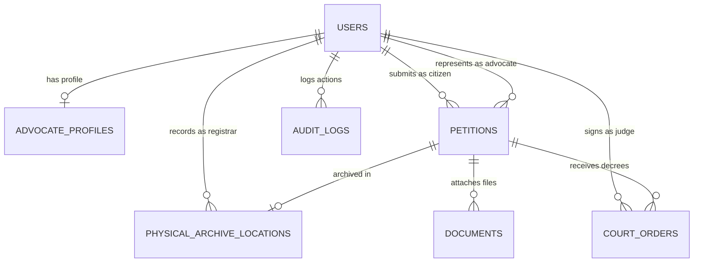

# Database Architecture - NyayaFlow AI

This document details the database schema designed for PostgreSQL/Supabase sovereign deployments of the NyayaFlow AI Platform.

---

## 📊 Entity Relationship Schema

The database model is highly normalized, utilizing foreign key constraints to link case files, physical archives, and bench decrees directly back to verified court user identities.

---

## 🗄️ Tables and Fields Definition

### 1. `users`
Stores verified system-wide credentials and digital signatures.
*   `id` (UUID, Primary Key): Unique system user identifier.
*   `email` (VARCHAR, Unique): Login address.
*   `full_name` (VARCHAR): Certified name.
*   `role` (VARCHAR, Constraint check): Assigned permission levels (`citizen`, `advocate`, `police`, `registrar`, `judge`, `admin`).
*   `phone` (VARCHAR, Unique): Linked for SMS notifications.

### 2. `advocate_profiles`
Detailed qualifications, mapped 1-to-1 to a corresponding Advocate user.
*   `id` (UUID, Primary Key): Profile identifier.
*   `user_id` (UUID, Foreign Key): References `users.id`.
*   `bar_council_no` (VARCHAR, Unique): Official Bar Council verification license.
*   `specialization` (VARCHAR): Primary legal category specialty.
*   `experience_years` (INTEGER): Years in practice.
*   `languages` (VARCHAR): Spoken Indian regional languages.
*   `fee_estimate` (VARCHAR): Advisory pricing range.

### 3. `petitions`
The central case dispute ledger.
*   `id` (UUID, Primary Key): Petition dossier identifier.
*   `citizen_id` (UUID, Foreign Key): Reference to the claimant.
*   `advocate_id` (UUID, Foreign Key, Null): Reference to the representing lawyer.
*   `category` (VARCHAR): Case category (Civil, Cyber, Property, etc.).
*   `description` (TEXT): Incident details.
*   `language` (VARCHAR): Primary input language.
*   `suggested_court` (VARCHAR): AI suggested filing destination.
*   `ai_confidence` (VARCHAR): Accuracy rating.
*   `status` (VARCHAR, Constraint check): Workflow status (`Scrutiny Pending`, `Registry Audited`, `CNR Issued`, `Hearings Active`, `Disposed`, `Returned`).
*   `cnr_number` (VARCHAR, Unique, Null): Official court CNR. **(NEVER SET BY AI)**.

### 4. `physical_archive_locations`
Links digitized case profiles directly to physical file locations.
*   `id` (UUID, Primary Key): Archival reference.
*   `petition_id` (UUID, Foreign Key, Unique): References `petitions.id`.
*   `building` (VARCHAR): Court storage building.
*   `floor` (VARCHAR): Floor identifier.
*   `room_number` (VARCHAR): Specific archival room.
*   `rack_number` (VARCHAR): Shelf rack index.
*   `box_number` (VARCHAR): Stamped storage box identifier.
*   `file_barcode` (VARCHAR, Unique): Scannable file barcode.
*   `logged_by` (UUID, Foreign Key): Registrar user who logged the record.

### 5. `documents`
Uploaded PDF evidence or petition files.
*   `id` (UUID, Primary Key): File identifier.
*   `petition_id` (UUID, Foreign Key): References `petitions.id`.
*   `file_name` (VARCHAR): Name of file.
*   `file_url` (VARCHAR): Storage endpoint path (e.g. Cloudinary).
*   `file_type` (VARCHAR): Content extension.
*   `ocr_text` (TEXT): Scanned OCR text extracted for AI auditing.
*   `health_score` (INTEGER): Completed audit health score (0-100).
*   `is_verified` (BOOLEAN): Registry validation flag.

### 6. `court_orders`
Official bench orders entered during daily causes.
*   `id` (UUID, Primary Key): Order identifier.
*   `petition_id` (UUID, Foreign Key): References `petitions.id`.
*   `judge_id` (UUID, Foreign Key): Presiding Judge who signed the order.
*   `hearing_date` (TIMESTAMP): Date of hearing.
*   `action_taken` (VARCHAR): Adjourned, Passed Temporary Injunction, Disposed.
*   `order_text` (TEXT): Certified order details.

### 7. `audit_logs`
Immutable database transaction logs.
*   `id` (UUID, Primary Key): Log identifier.
*   `user_id` (UUID, Foreign Key, Null): Active actor.
*   `action` (VARCHAR): Description of database read/write.
*   `ip_address` (VARCHAR): Source host address.
*   `created_at` (TIMESTAMP): Date of transaction.
